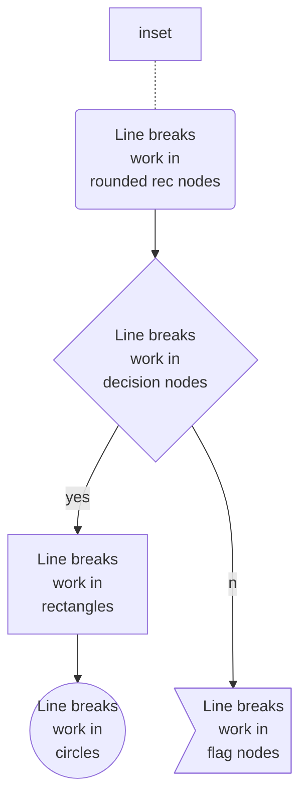

并查集求最小环
Dp加半维

```mermaid
graph TD;

    inset-.-A

  A(Line breaks<br />work in<br />rounded rec nodes)
  B{Line breaks <br />work in<br />decision nodes}
  C[Line breaks<br />work in<br /> rectangles]
  D((Line breaks <br />work in <br />circles))
  E>Line breaks <br />work in <br />flag nodes]


    A-->B
    B--yes-->C
    B--no-->E
    C-->D
```
<!--stackedit_data:
eyJoaXN0b3J5IjpbLTk3NTI3MDc2OCwtMjA3MDA5NzIwMSwtNz
IxMDg0MzM3LC0xNTkxNDEzMTAsLTIwMDcxMTA1MzgsMTU1NjMx
OTE4MF19
-->