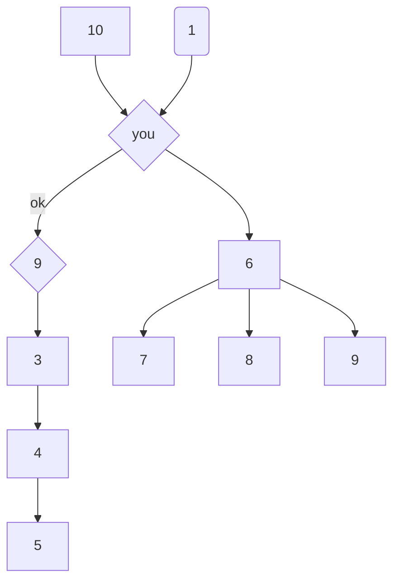
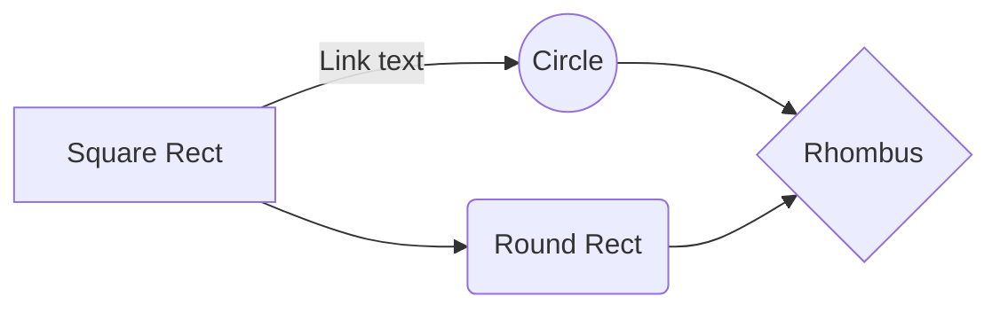

并查集求最小环
Dp加半维


``` mermaid
graph TD
    10-->1
    11(1)-->1
    1{you}-->|ok|2{9}
    2-->3
    3-->4
    4-->5
    1-->6
    6-->7
    6-->8
    6-->9
```
```

```mermaid
graph LR
    A[Square Rect] -- Link text --> B((Circle))
    A --> C(Round Rect)
    B --> D{Rhombus}
    C --> D
```
```
<!--stackedit_data:
eyJoaXN0b3J5IjpbLTE3NjMwNzI4MTUsLTE1OTE0MTMxMCwtMj
AwNzExMDUzOCwxNTU2MzE5MTgwXX0=
-->